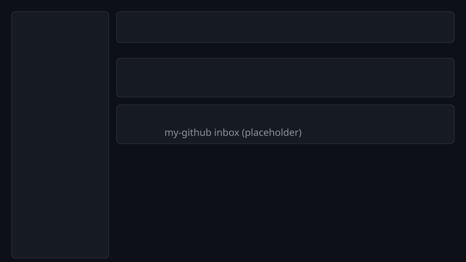

# my-github

> GitHub cross-repository dashboard desktop app — view PRs, Issues, CI status, and Notifications across multiple repos in one keyboard-driven window.

## Screenshot



_Note: replace with a real capture after UI polish._

<!-- Screenshot placeholder — add after first UI milestone -->
<!--

-->

## Features (v0.1.0)

- **Inbox-first** — Review requests, CI failures, and mentions in one view
- **Multi-account** — Switch between personal and work accounts (⌘T)
- **Keyboard-native** — J/K navigation, ⌘K command palette
- **In-app GitHub actions** — Submit PR reviews, merge, close/reopen issues, and more from the app (with offline write queue retry)
- **Dark theme** — macOS + Windows binaries
- **GHES / multi-host (foundation)** — Settings can store a custom host per PAT account; API clients use `GithubClient::with_base_url` when a host is set. Full GHES sync parity (GraphQL path quirks, OAuth Device Flow on enterprise) is not complete yet.

## Prerequisites

| Tool | Version | Install |
|------|---------|---------|
| Rust | 1.82+ | `curl --proto '=https' --tlsv1.2 -sSf https://sh.rustup.rs \| sh` |
| Node.js | 20+ | [nodejs.org](https://nodejs.org) |
| pnpm | latest | `npm install -g pnpm` |
| Tauri CLI | 2.x | included via `pnpm tauri` |

**macOS only:** Xcode Command Line Tools (`xcode-select --install`)

**Linux only:**

```bash
sudo apt-get install libwebkit2gtk-4.1-dev libgtk-3-dev \
  libayatana-appindicator3-dev librsvg2-dev patchelf
```

## Tech Stack

| Layer | Technology |
|-------|-----------|
| Framework | Tauri 2 |
| Backend | Rust stable ≥ 1.85 (reqwest + tokio, graphql_client) |
| Local DB | SQLite (rusqlite + r2d2) |
| Token Storage | keyring (OS keychain) |
| Frontend | React 19 + TypeScript 5.x |
| Build | Vite |
| Styling | Tailwind CSS v4 (dark theme) |
| State | Zustand |
| Routing | react-router-dom |

## Development

```bash
# Install dependencies
pnpm install

# Start dev server (hot reload for frontend + Rust rebuild on save)
pnpm tauri dev
```

Sign in with a GitHub Personal Access Token (PAT).

Periodic GitHub sync is driven by the **frontend** (`useNotificationPolling` + `cmd_sync_now` on focus). The Rust backend does not spawn a background poller at startup.

### Debug token storage

Production builds store PATs in the OS keychain. **Debug builds** (`pnpm tauri dev`) write tokens to a plaintext JSON file instead:

```
${XDG_DATA_HOME:-~/.local/share}/my-github-dev/tokens.json
```

On macOS without `XDG_DATA_HOME`, use `~/Library/Application Support/my-github-dev/tokens.json`.

To reset login state during development, quit the app and delete `tokens.json` (or remove the account in Settings → Accounts).

## Build

```bash
# Production binary (output: src-tauri/target/release/bundle/)
pnpm tauri build
```

## Lint & Format

```bash
# Rust (from repo root — manifest lives in src-tauri/)
cargo test --manifest-path src-tauri/Cargo.toml

cargo fmt --manifest-path src-tauri/Cargo.toml --check
cargo clippy --manifest-path src-tauri/Cargo.toml -- -D warnings

# TypeScript / Frontend
pnpm exec tsc --noEmit
pnpm lint
```

## Performance

Targets from product requirements: **&lt;800ms** cold start (cached), **&lt;200MB** idle memory, **&lt;30MB** macOS dmg.

After a release build, measure binary and bundle sizes:

```bash
pnpm tauri build
./scripts/measure-size.sh
```

## Recommended IDE Setup

- [VS Code](https://code.visualstudio.com/) + [Tauri](https://marketplace.visualstudio.com/items?itemName=tauri-apps.tauri-vscode) + [rust-analyzer](https://marketplace.visualstudio.com/items?itemName=rust-lang.rust-analyzer)

## License

MIT
